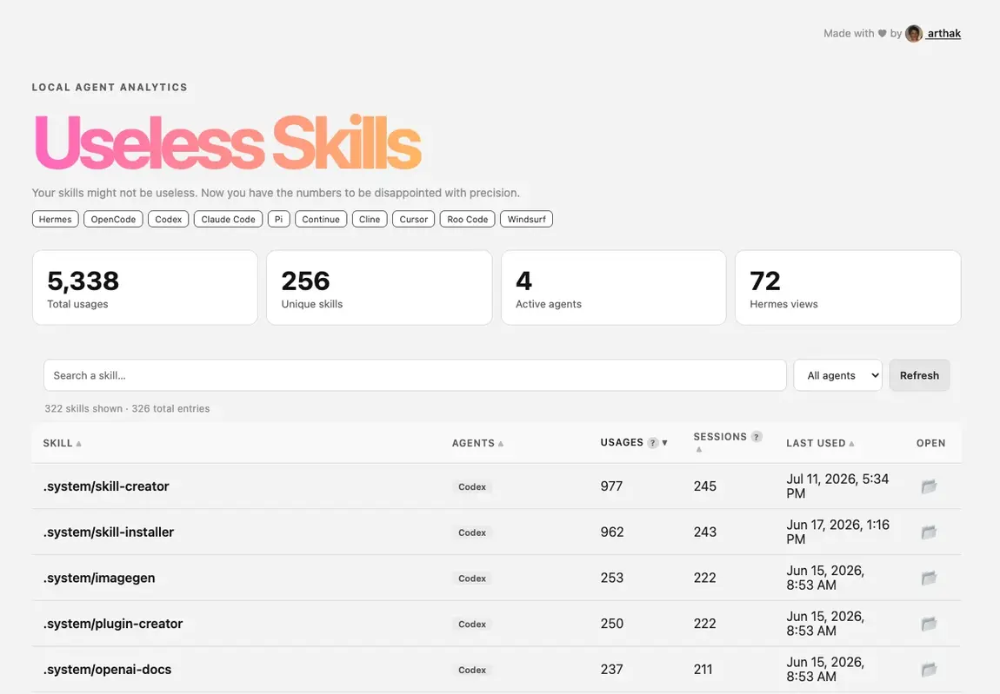

# Useless Skills



Local dashboard that aggregates skill usage from Hermes, OpenCode, Codex, Claude Code, Pi, Continue, Cline, Cursor, Roo Code, and Windsurf when their data is available.

## Launch

```bash
cd ~/dev/useless-skills
./useless-skills
```

Options:

```bash
./useless-skills --port 9000
./useless-skills --no-open
./useless-skills --json
./useless-skills --no-cache   # force a full rescan, skip the build cache
./useless-skills --version    # print the version and exit
```

The first run scans every agent's session logs (Codex logs alone can be
hundreds of MB, so it may take a few seconds). Results are cached on disk
under `.cache/` keyed on the modification times of all input sources, so
repeat runs (`--table`, `--toon`, `--json`) are instant until a source
changes. JSONL scanning also skips any file that does not mention `SKILL.md`.

## CLI table

```bash
./useless-skills --table
```

Renders a terminal table of skill usage. In a real terminal it becomes interactive.

```bash
./useless-skills --table --query "agent=Codex" --sort sessions --limit 20 --offset 40
./useless-skills --table --search seo --reverse
./useless-skills --table --open
```

### Interactive shortcuts

| Key | Action |
|-----|--------|
| `n` / `p` | Next / previous page |
| `f` | Filter (`agent=X`, `skill=Y`, or plain text) |
| `1`-`5` | Sort by `uses`, `sessions`, `skill`, `agent`, `last_used` (press again to toggle ASC/DESC) |
| `c` | Clear filters and sort |
| `o` | Open web dashboard in background |
| `q` | Quit |

Press `Ctrl+C` during prompts to return to the table instead of crashing.

### CLI flags

| Flag | Description |
|------|-------------|
| `--limit N` | Max rows (default: terminal height for table, `100` for toon) |
| `--offset N` | Skip N rows |
| `--query` | Global filter (`agent=X`, `skill=Y`, or text) |
| `--search` | Substring match on skill name (backward-compat shorthand) |
| `--agent` | Filter by agent name (backward-compat shorthand) |
| `--sort` | `uses`, `sessions`, `skill`, `agent`, `last_used` |
| `--reverse` | Reverse default sort order |

## TOON output

```bash
./useless-skills --toon
```

Compact columnar format for agents. Defaults to 100 rows.

```bash
./useless-skills --toon --limit 50 --offset 100 --query Codex
```

Hermes and OpenCode provide structured counters. Other agents are measured by explicit `SKILL.md` file reads, so their numbers are minimums.

## Releases

Versioning follows SemVer, tracked in `VERSION` with human-readable notes in
`CHANGELOG.md` (one `## X.Y.Z` section per release). The version is shown by
`./useless-skills --version`.

To cut a release:

1. Add a `## X.Y.Z` entry at the top of `CHANGELOG.md`.
2. Update `VERSION` to `X.Y.Z`.
3. Commit and tag it: `git tag vX.Y.Z && git push origin vX.Y.Z`.

Pushing a `vX.Y.Z` tag triggers `.github/workflows/release.yml`, which verifies
the tag matches `VERSION`, builds a tarball plus `SHA256SUMS`, and creates a
GitHub release using the matching changelog section as notes.
